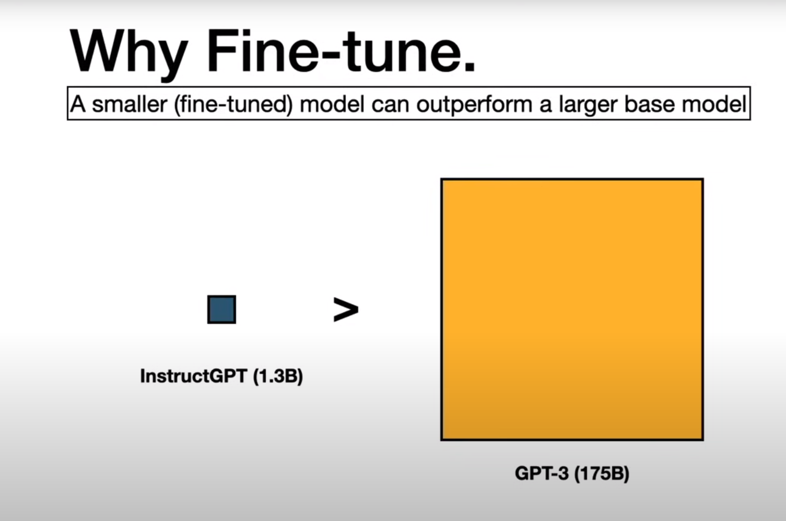
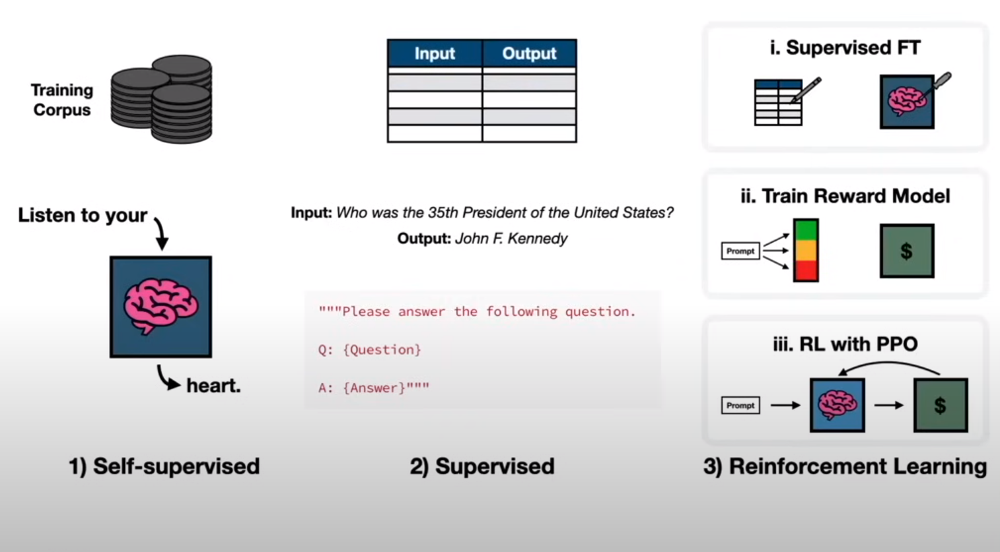
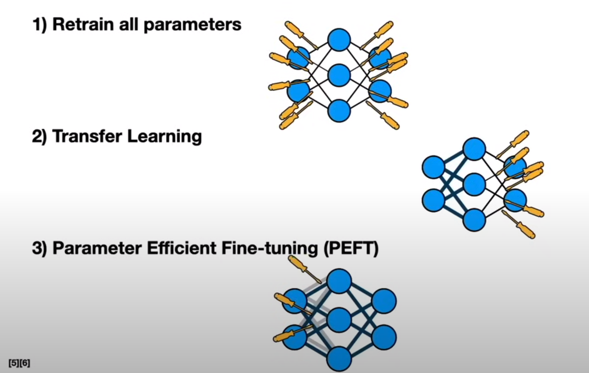

# Fine Tuning LLM



## How



### Self Supervised
### Supervised
### Refinforcement Learning

https://towardsdatascience.com/fine-tuning-large-language-models-llms-23473d763b91

### Supervised




### Retrain all parameters
### Transfer Learning
只 training 一部分参数
### Parmeter Efficient Fine Tuning
不改变原来的参数，加一层？！
#### Lora
[知乎|深入浅出Lora](https://zhuanlan.zhihu.com/p/650197598)

## B站大战弱智吧

### Data
https://github.com/linyiLYi/bilibot

### 从模型下载
```
import torch
from modelscope import snapshot_download, AutoModel, AutoTokenizer
import os
model_dir = snapshot_download('qwen/Qwen2-7B-Instruct', cache_dir='/root/autodl-tmp', revision='master')
```

### 运行模型

[!code-python](./runmodel.ipynb)

### Fine Tuning

[!code-python](./finetune.ipynb)


## Self LLM
https://github.com/datawhalechina/self-llm/blob/master/Qwen2/05-Qwen2-7B-Instruct%20Lora%20%E5%BE%AE%E8%B0%83.md
