# Pretraining LLMs

## why-pre-training

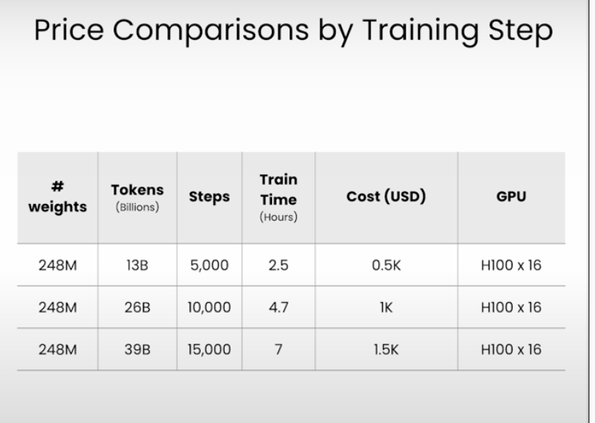

## data preparation

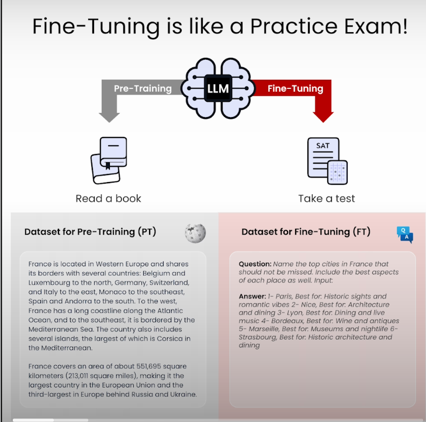

Pre-Traing is like reading!
Fine-Tuning is specify task!

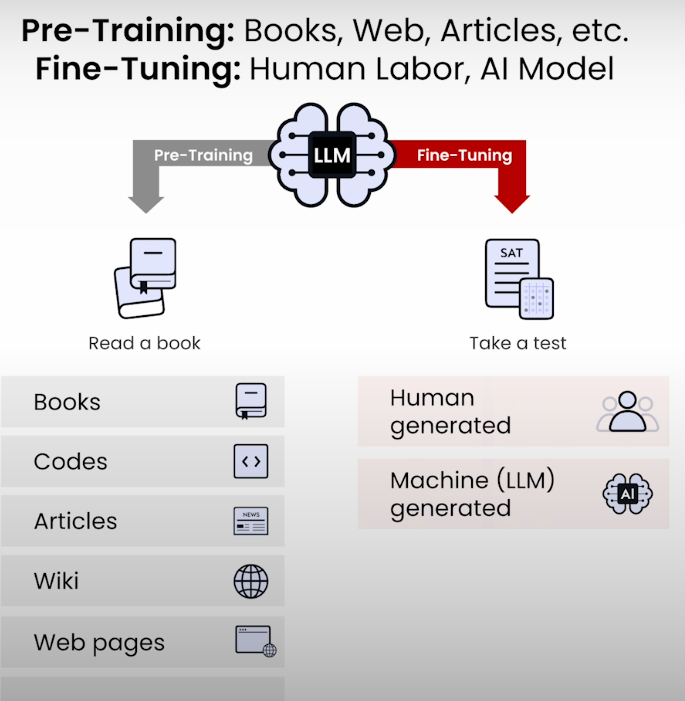

## packaging-data-for-pretraining

### tokenization

### Data Packing

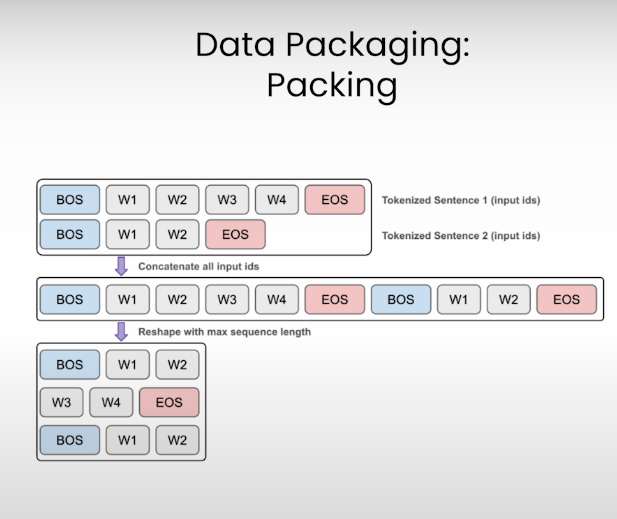

## model-initialization

### decoder only

预测下一个token。
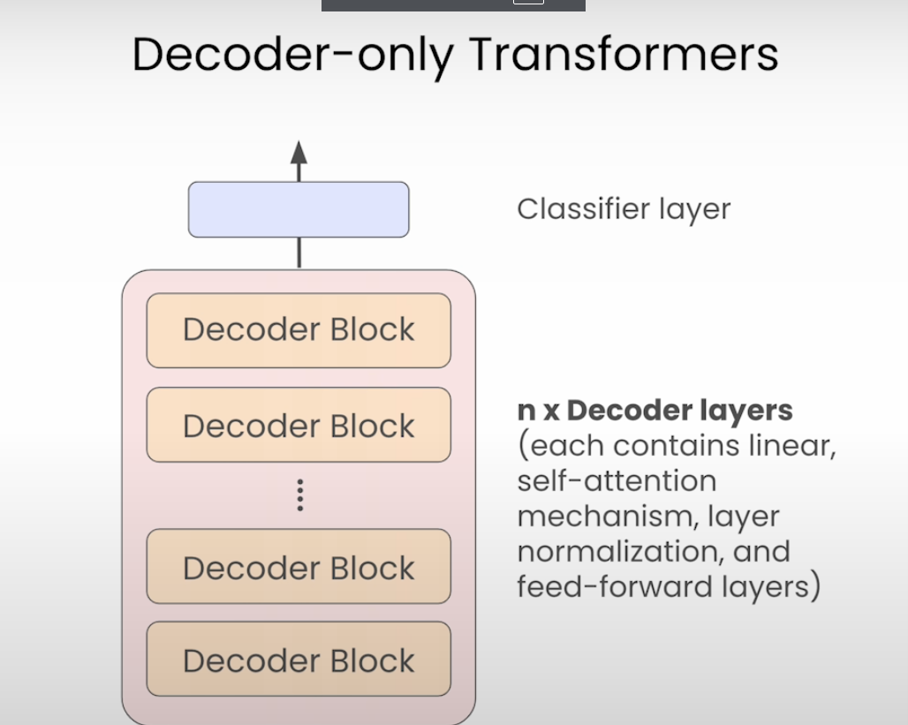

### weights

Random weights
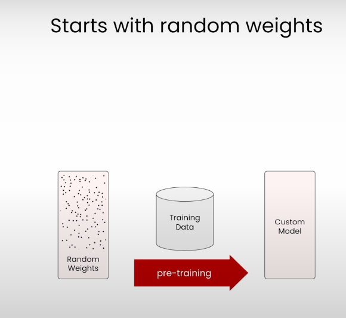

Existing Model weights, continue training
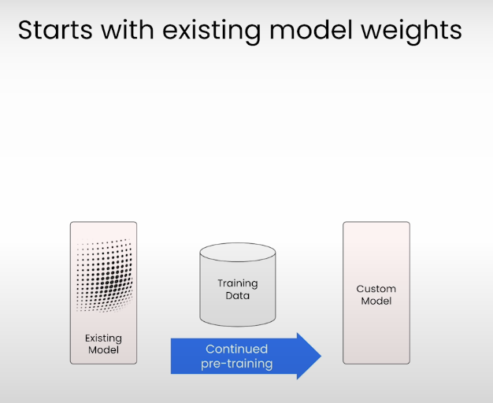

Downscaling an existing model
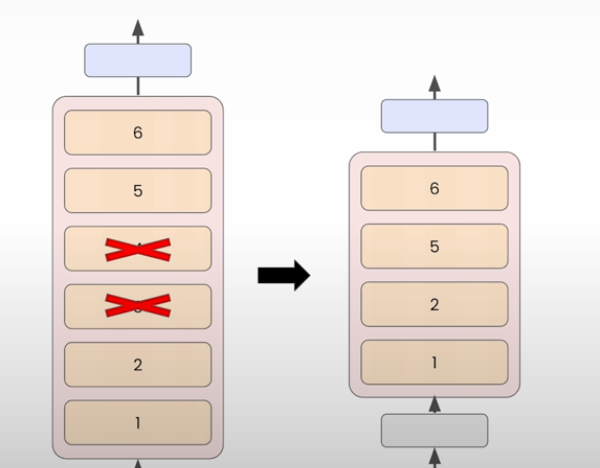

Upscaling an existing model
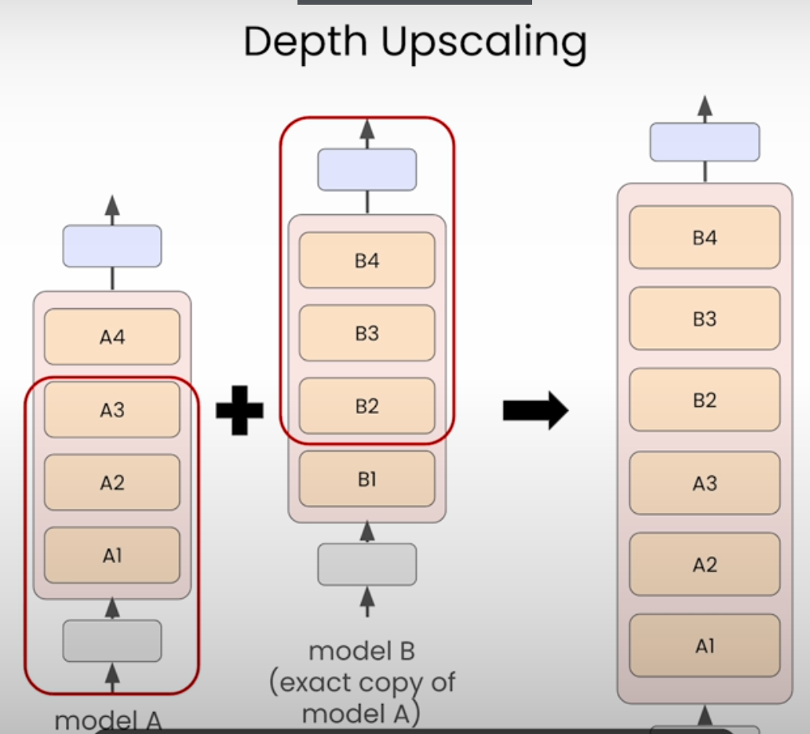

## training-in-action

### Training Cycle

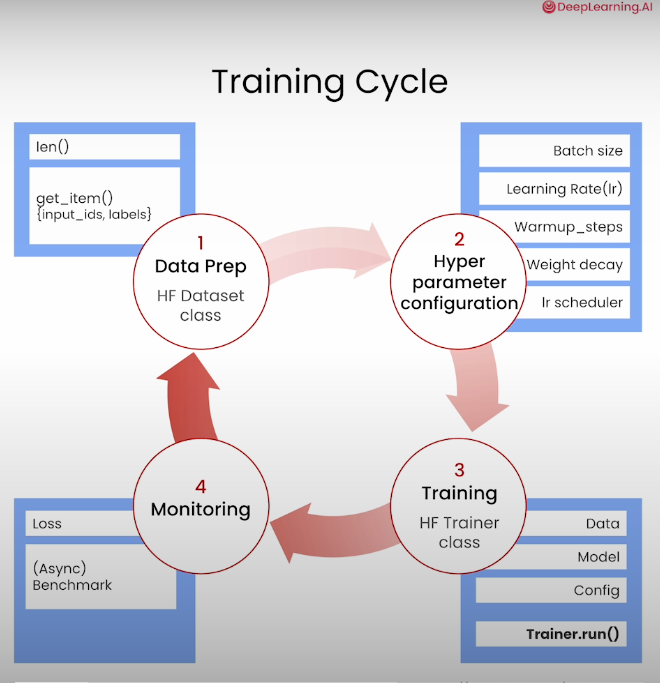

### Cost
https://huggingface.co/training-cluster

## evaluation
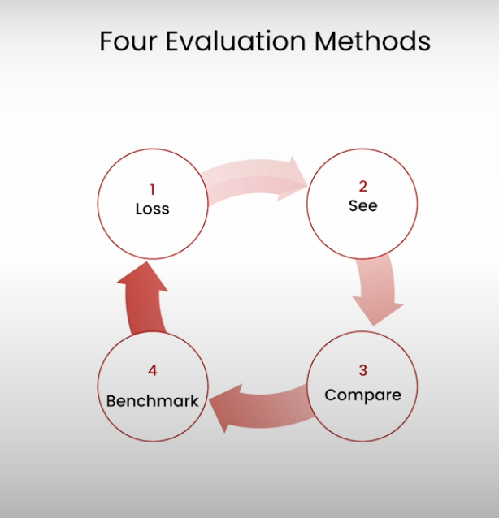

### Loss: trend

如果不对，就看下dataset 和 training arguments
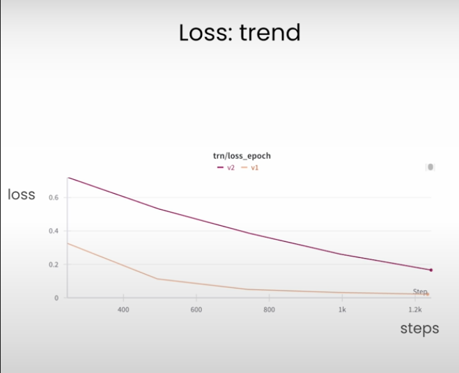

### see for yourself

人工很重要。

### compare with others

也需要人工

### benchmark

https://huggingface.co/open-llm-leaderboard

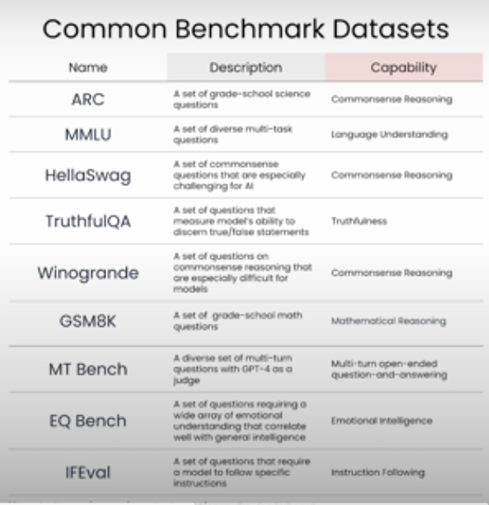

